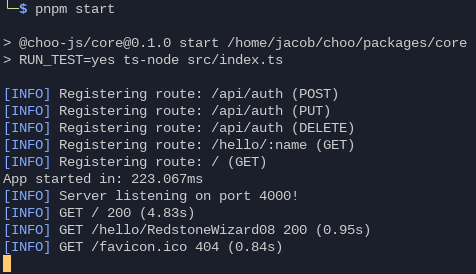

# Choo.js

A multilingual full-stack web application toolkit, inspired by Ruby on Rails.

## About

I have been looking for a long time for an alternative to Ruby on Rails, since I
don't enjoy coding in Ruby and Rails is also very slow. I want to create an
extremely fast web application framework like Ruby on Rails that makes it very
easy to migrate to, from Rails. This is where Choo.js comes in. It allows you
to use your favorite backend language, whether it be TypeScript, Rust, Go,
or even plain JavaScript, as well as bringing your own frontend framework, or
even just using plain templates.

## Features

- [x] 100% written in TypeScript.
- [x] A blazingly fast server framework based on Fastify. (See [@choo-js/coal](packages/coal/))
- [x] Database support with TypeORM.
- [x] Request logging. (See [@choo-js/logger](packages/logger/) and [logger.ts](packages/coal/src/middleware/logger.ts))
- [x] Route parameter support.
- [x] Query parsing.
- [x] Body parsing.
- [x] Full controller support for requests and middleware.
- [ ] An easy CLI to manage your app. (See [@choo-js/cli](packages/cli/))
- [ ] A custom ERB-like templating language. (See [@choo-js/templates](packages/templates/))
- [ ] Static asset handling.
- [ ] Asset bundling. (See [@choo-js/bundler](packages/bundler/))
- [ ] Production build optimization and minification.
- [ ] Standalone production build binary generator.
- [x] Secure authentication API. (See [@choo-js/ticketing](packages/ticketing/))
- [x] REST API creation support.
- [ ] Support for TypeScript-based backends.
- [ ] Frontend builds with ESBuild and a custom build API.
- [ ] Support for frontends with Svelte, React, Preact, Vue, and templating languages. (See [@choo-js/frontend](packages/frontend/))
- [ ] Support for Rust-based backends (native node modules).
- [ ] Support for Go-based backends (native node modules).

## Project Directories

The directory structure of any Choo.js project is as follows:

- api/ => The API and main code for the backend.
- app/ => The frontend application code, if you choose to use a framework.
- auth/ => The authentication code and config, allows you to use our in-house auth suite or bring your own.
- config/ => The general app config. This allows you to configure your app as you choose.
- controllers/ => The controllers to configure routes throughout your app.
- layouts/ => The templates for layouts in the app.
- migrations/ => SQL (or other) scripts to run for database migrations. Only run if the tables do not exist.
- models/ => SQL (or other) models for entities and tables. Supports relations.
- seeds/ => Database default data (seeds). Run after migrations.
- scripts/ => Utility scripts you can run during development.
- static/ => Static assets for your app to use.
- views/ => Views to render in your app.

## Showcase

## Contributing

This project is under the MIT license, and we are always looking for collaborators! Please open a PR or an issue if you see something you want added.

More: See [CONTRIBUTING.md](CONTRIBUTING.md)
